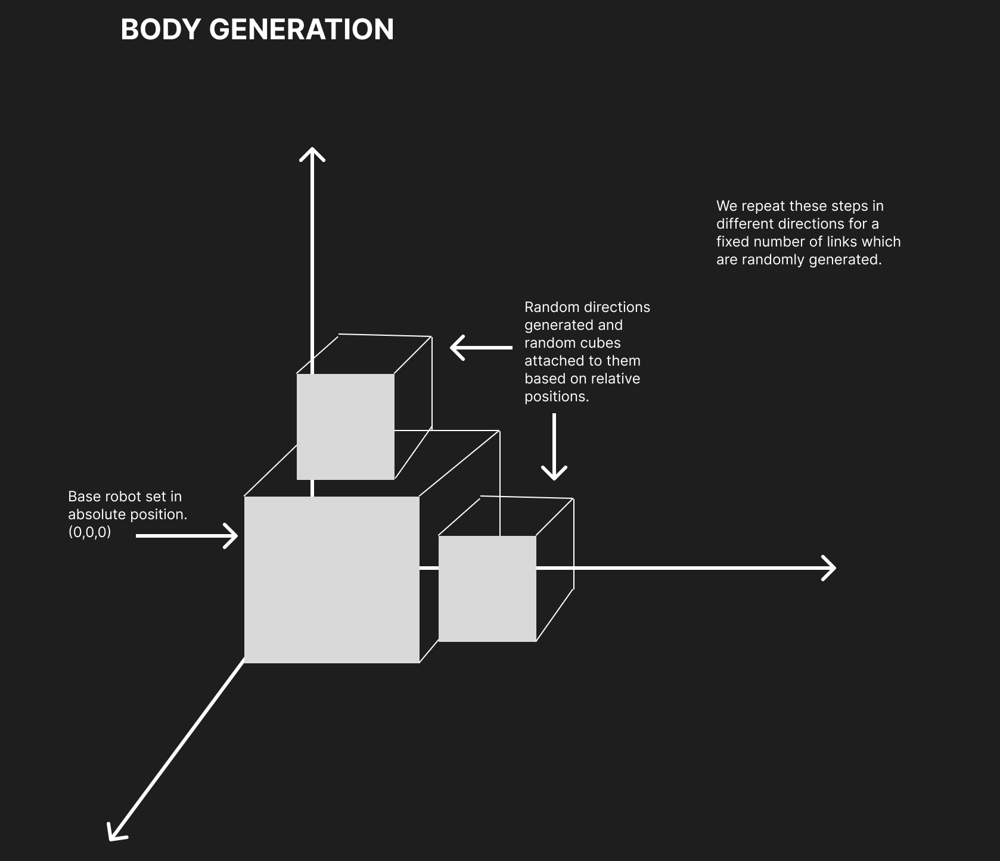
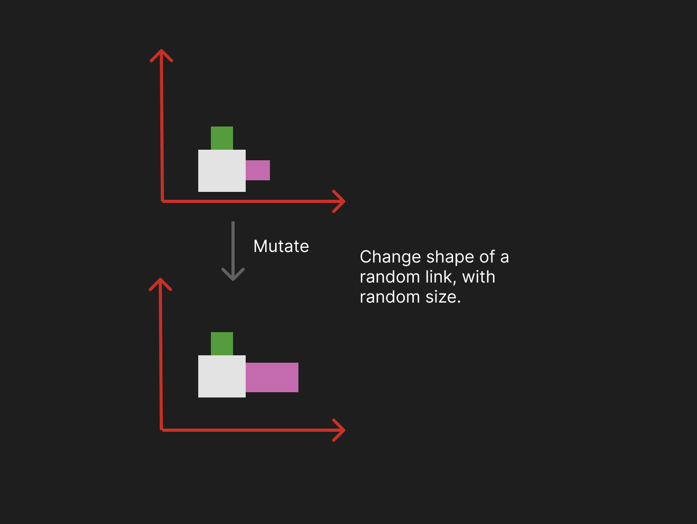
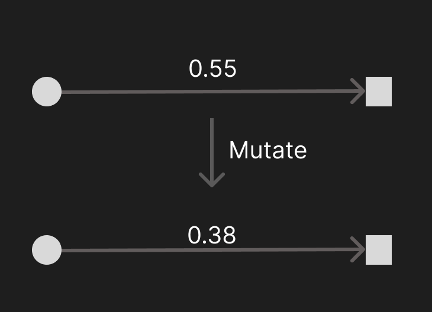
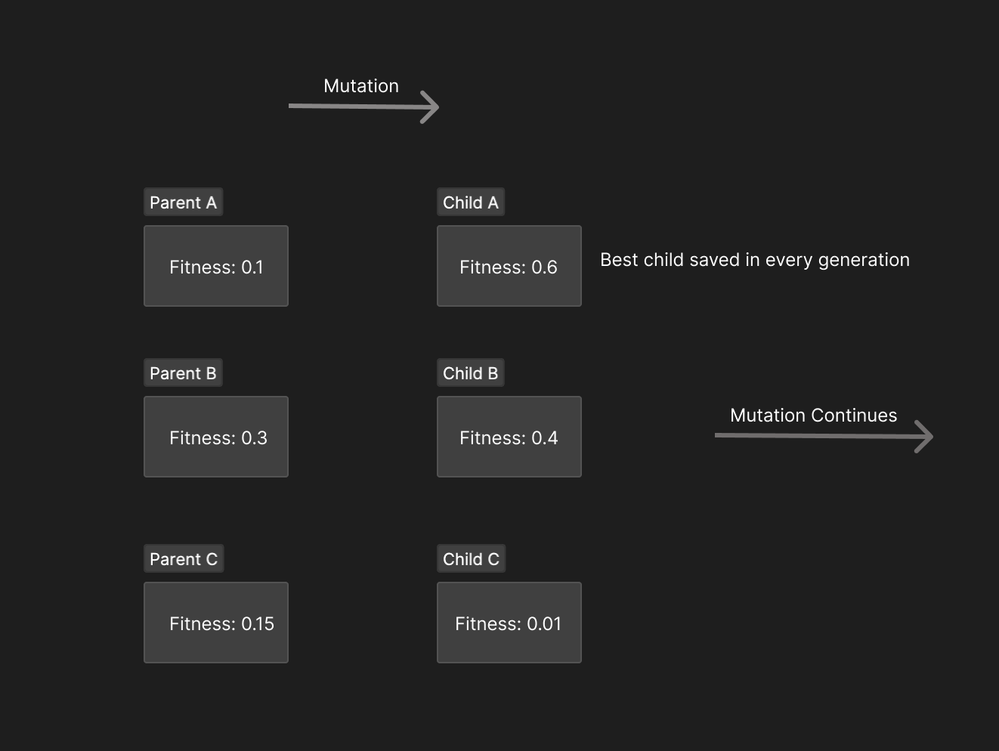
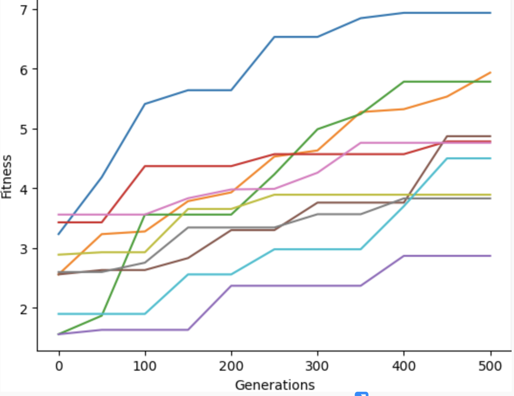

# Ludobots
3d bot simulations

Generating a random assortment of cubical body parts with different color for sensors and links. 


This is a tool that generates random creatures with the aim of moving in a particular direction (x direction). The creatures are made up of a variable number of links, and assigned sensors with some probablity. with a set number of links we generate a body and mutate it based on their movement in x direction. Fitness works on improving the x direction.


## Body generation



The body is generated by setting a block at (0,0,0) with different sizes randomly generated. For further blocks, we add blocks related to the original joint positions to the original block. The blocks are added in random directions and the steps above are repeated for multiple steps. 

## Brain Generation


The sensors are added to motors to each joint of the robot based on random int generation. If the random int allows it we place a sensor in the joint and the link is coloured green else the link is a normal cube with blue colour.


## Mutation and evolution

To evolve the bodies we use two kinds of mutations based on coin flips:

a) Body mutation



- The kind of mutation that happens here is that we pick random links and update their sizes based on randomness, the idea here is that hopefully we mutate to a body with better shape that helps with locomotion.

b) Changing weights



- We randomly pick synaptic weight to modify and replace its value with a new random value between -1 and 1.

## Fitness and picking new generations



- In order to select the most appropriate robot from each generation, we use parallel hill climber method. This approach requires creating a group of multiple robots and generating a new offspring with a random mutation for each member of the parent population in every generation. The robot with the highest fitness score, obtained from both parents and offspring, is chosen to advance to the next generation. This process is repeated at each generation, leading to the selection of robots with greater capabilities over time. The accompanying diagram provides a visual representation of this procedure.

Youtube Video: https://youtu.be/fdTYdauiA58

## Fitness Curves



Fitness curves for 10 random seeds for population size 5 and generations 500.

## Citation

Code influenced from two sources:
- Pyrosim package: https://github.com/jbongard/pyrosim
- r/ludobots - https://www.reddit.com/r/ludobots/ 

## How to run
```
python search.py

Note: There are 10 bodies that I evolved from previous generation saved as "bodyFit*.py". To run these bodies, replace one line from robot.py "self.robotId = p.loadURDF("bodies0"+ ".urdf")" with bodyFit from one of the saved bodies using "self.robotId = p.loadURDF("bodyFit1"+ ".urdf")"
```

